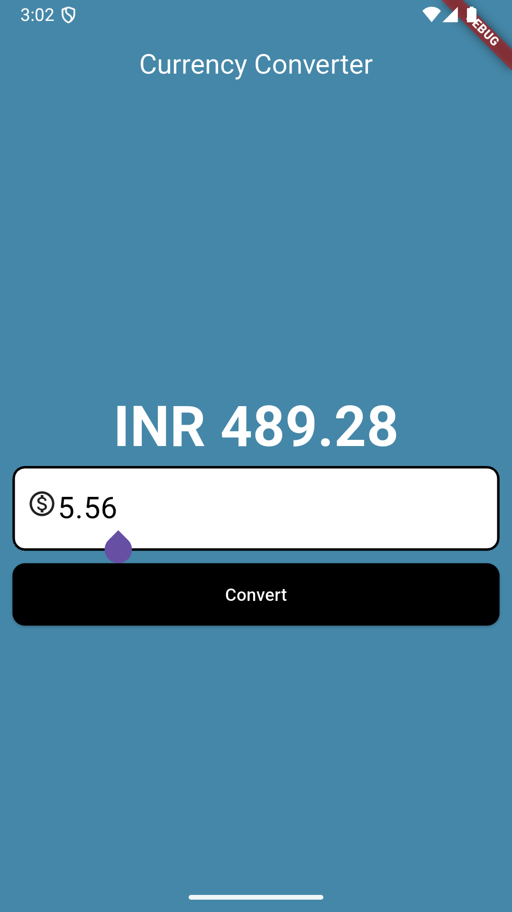

# 💱 Currency Converter App

A simple and modern Flutter app to convert between currencies in real-time using a free exchange rates API.  
Built as part of my Flutter learning journey while transitioning from 10+ years of Magento/PHP development to cross-platform mobile apps.

---

## ✨ Features
- 🌍 Convert between 150+ currencies
- 🔄 Real-time exchange rates via [ExchangeRate API](https://exchangerate.host/)
- 💡 Simple and clean UI
- 📱 Works on Android, iOS, and Web
- ⚡ Error handling and loading states

---

## 🛠️ Tech Stack
- [Flutter](https://flutter.dev/) (Dart)
- [Riverpod](https://riverpod.dev/) for state management
- [HTTP](https://pub.dev/packages/http) for API integration

---

## 📸 Screenshots
<p align="center">
  
</p>


## 🚀 Getting Started
1. Clone the repository
   ```bash
   git clone https://github.com/anil90/currency_converter_flutter.git
   cd currency_converter_flutter
